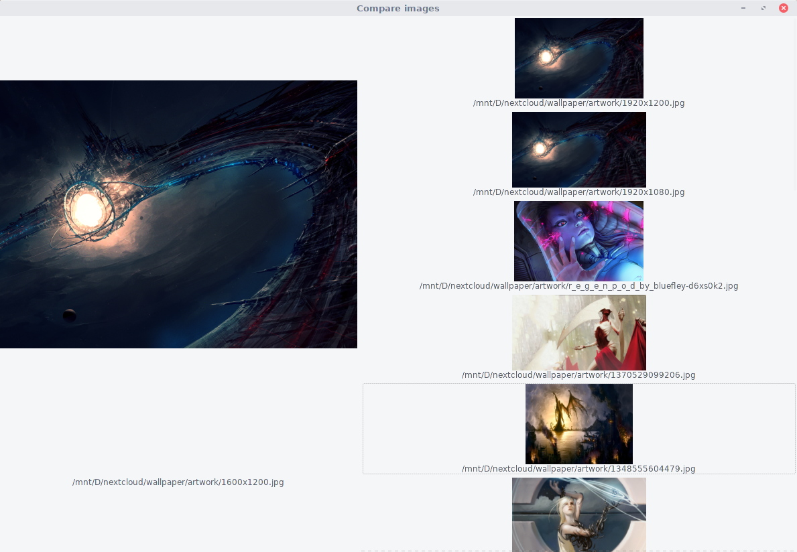

# Compare Images
The goal of this project is to create a image comparator, to help find duplicates (but yet different bit-wise) images in a folder.

At the moment, it finds the nearest neighbors to the target, according to the defined distance. Which is really basic and bad, by the way.
It cannot tell by itself if the files are the same.

## Use
### Command line
Just type
```bash
./comparator/comparator.py <target> <folder>
```
`target` is the file we want to compare, and `folder` is where we want to look for duplicates. It is not recursive yet.

It will then print a sorted list of the found images and the distance with the target. A distance of 0 is a perfect match.

### GUI to display results
The syntax is similar
```bash
./interface.py <target> <folder>
```
It will display the results in the following way:



## Todo
* Support recursion in folders
* Add an option to select how many NN we want to select
* Use a more robust framework for the script parameters
* Add option for the number of nearest neighbors we want to have
* Find a usable feature extractor to improve performances

## Done
* Profile the script

